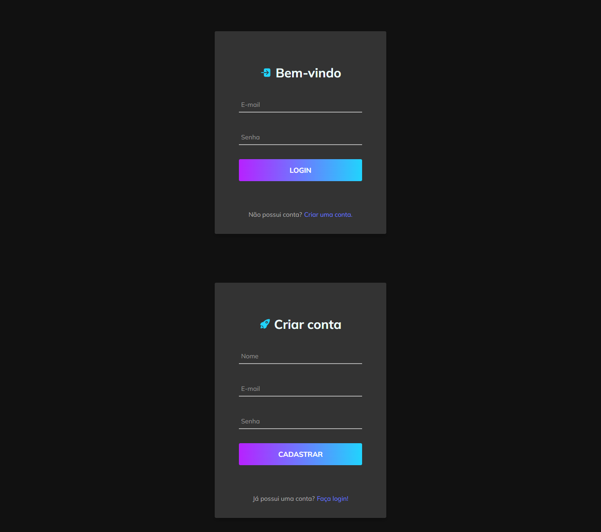

<div align="center">

[![GNU License][license-shield]][license-url]
[![Version][version-shield]][version-shield]

</div>

<br />
<div align="center">
    <a href="https://github.com/joaosouza7/login-page">
    
    </a>
    <br />
    <br />

  <p align="center">
    Tela de login e registro de usuários
    <br />
    <a href="https://github.com/joaosouza7/login-page"><strong>Explore o documento »</strong></a>
    <br />
    <br />
  </p>
</div>

## 💻 Sobre o projeto

Tela de login e registro de usuários feita para práticar os conhecimentos com estados, sistema de rotas e animações.


## 🔎 Preview do projeto

<p align="center">
  
</p>


## 🛠 Tecnologias

As seguintes ferramentas foram utilizadas no desenvolvimento do projeto.

* [![HTML][html]][html-url]
* [![CSS][css]][css-url]
* [![Java Script][javascript]][javascript-url]
* [![React.js][react]][react-url]


## 🚀 Como executar o projeto?

### Pré-requisitos

Antes de começar, você vai precisar ter instalado em sua máquina as seguintes ferramentas:
[Git][git-url], [Node][node-url]. 
Além disto é bom ter um editor para trabalhar com o código como o [VSCode][vscode-url].

### 🎲 Rodando a aplicação

```bash
# Clone este repositório
$ git clone https://github.com/joaosouza7/login-page

# Acesse a pasta do projeto no terminal/cmd
$ cd login-page

# Instale as dependências do projeto
$ npm install

# Execute a aplicação 
$ npm start

# O servidor inciará na porta:3333
# Acesse http://localhost:3333 
```


## 📝 Licença

Esse projeto está sob a licença [GNU][license-url]. Veja o arquivo `LICENSE` para mais detalhes.

[Entre em contato!][linkedin]

<!-- LINKS E IMAGENS -->

[linkedin]: https://www.linkedin.com/in/joaosouzadesenvolvedorweb

[license-shield]: https://img.shields.io/badge/LICENSE-GNU-green?style=for-the-badge
[license-url]: ./LICENSE

[version-shield]: https://img.shields.io/badge/VERSION-1.0.0-dc3545?style=for-the-badge

[git-url]: https://git-scm.com
[node-url]: https://nodejs.org/en
[vscode-url]: https://code.visualstudio.com/

[html]: https://img.shields.io/badge/HTML-239120?style=for-the-badge&logo=html5&logoColor=white
[html-url]: https://developer.mozilla.org/en-US/docs/Web/HTML

[css]: https://img.shields.io/badge/-CSS-blue?style=for-the-badge&logo=css3&logoColor=white
[css-url]: https://www.w3.org/Style/CSS/Overview.en.html

[javascript]: https://img.shields.io/badge/JavaScript-323330?style=for-the-badge&logo=javascript&logoColor=F7DF1E
[javascript-url]: https://developer.mozilla.org/en-US/docs/Web/JavaScript

[react]: https://img.shields.io/badge/React-20232A?style=for-the-badge&logo=react&logoColor=61DAFB
[react-url]: https://react.dev/